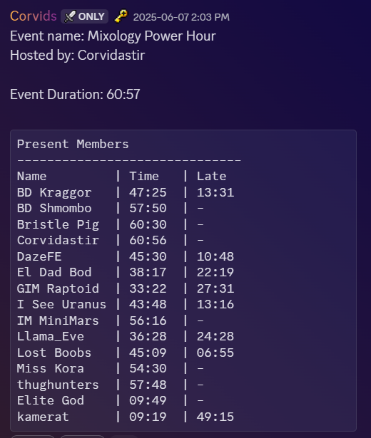
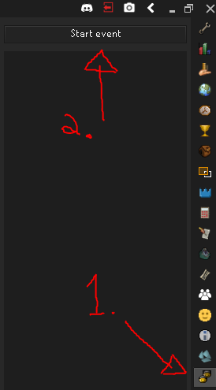
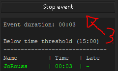
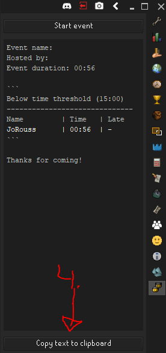
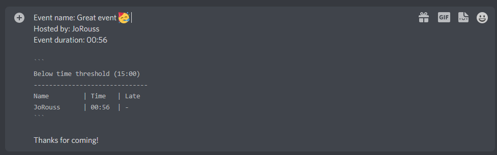
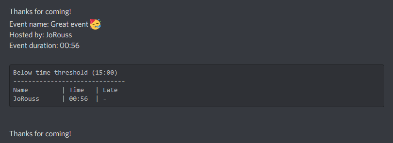
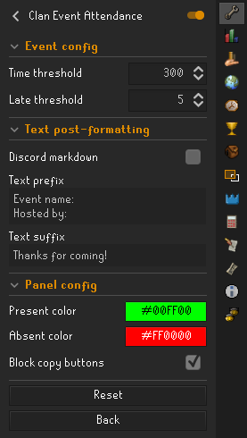

# Clan Event Attendance

Forked from [JoRouss](https://github.com/JoRouss/runelite-ClanEventAttendance)

A plugin used to generate a list of clan members attending an event.

It is designed so any clan member can take attendance at an event and post attendance to their clan's social media.

It tracks the event duration and for every clan member, the time spent at the event and how late they joined the event.

At the end of the event, you can copy/paste the attendance list to your clan's social media, like Discord.

The plugin also saves the attendance list to a local file for you to use as a backup.

| NOTE: If your event takes place in multiple instances, you can have multiple members of your clan run the plugin and merge the resulting lists manually afterward |
| ----------------------------------------------------------------------------------------------------------------------------------------------------------------- |

## How to use

1. Open the Clan Event Attendance panel.
2. Click "Start event". The plugin will start tracking clan members around you.  
   
3. When the event is over, click "Stop event".  
   
4. Click "Copy text to clipboard". This will place the text in your clipboard for you to paste it in your social media.  
   
5. Paste the result in your social media (ex.: Discord) and edit the event name and host if needed.  
   
6. Hit "Enter" to submit the event.  
   

## Config

The config page allows to:

- Time threshold: Set a time threshold to consider a member part of the event
- Late threshold: Set a time threshold to consider a member late at the event
- Discord markdown: Surround the final list with multiline code blocks markdown for better Discord display
- Text prefix: Type a text block that will be added on top of the final result
- Text suffix: Type a text block that will be added at the bottom of the final result
- Present/Absent colors: The color to display members while the event is running
- Block copy button: Prevents copying the text while the event is still running

## License

Clan Event Attendance is licensed under the BSD 2-Clause License License. See LICENSE for details.

## Author

JoRouss
